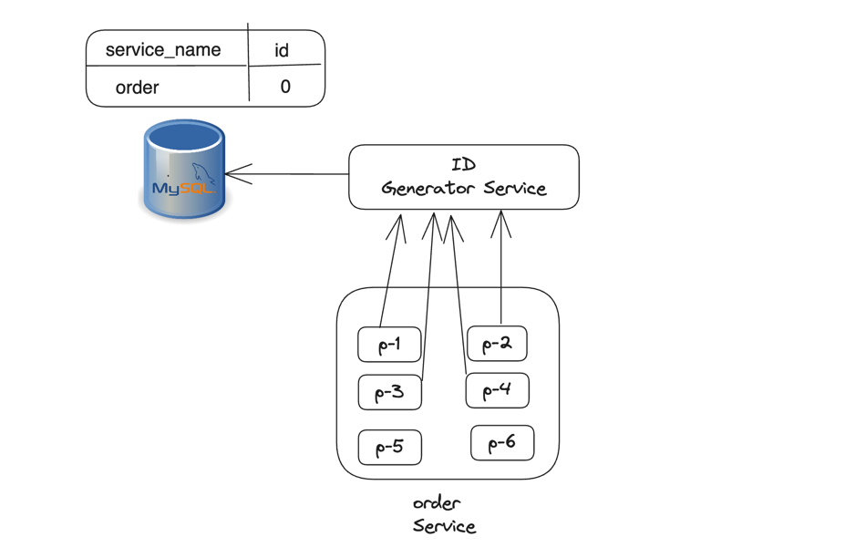
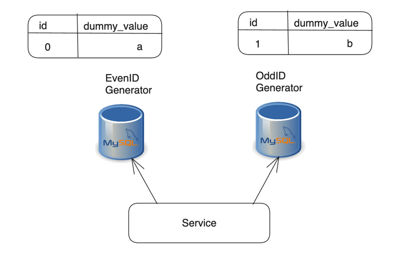
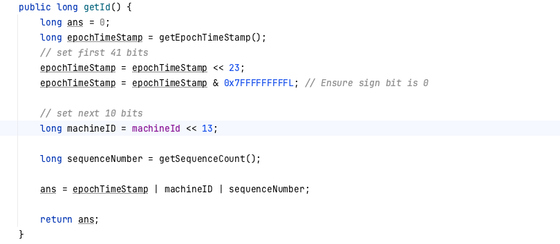

# Context
Developed a poc for understanding various ways for id generation

# Approaches

## Amazon Central ID Generation Service

Every application instance of order service will get ids from id generation service in batches during application bootstrap

## Flickr odd even id generator

Application instance will route request to odd and even id generator db instance in round-robin fashion

## Snowflake id generator
It is 64 bits long id . First 41 bits is epoch timestamp, next 10 bits is machine id and next 13 bits is sequence number

## Snowflake id generator using store procedure
It is same as above snowflake id generator. Difference is only is that id generation is happening at database level instead of application level